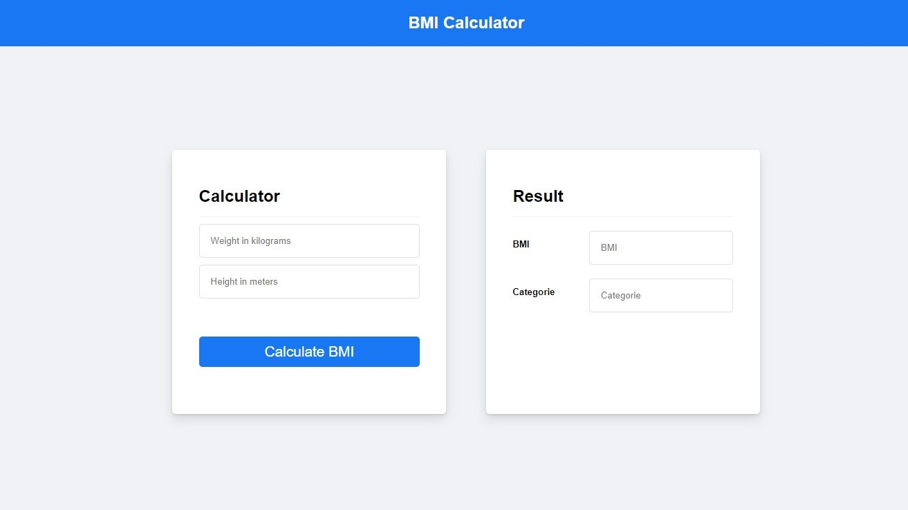

# BMI Calculator APP

## Project

This is a simple app that can calculate a person's BMI using weight and height. It's one of my first ReactJS apps available publicly.This app uses my [own BMI API](https://github.com/GabrielGustavoMS/BMICalculatorAPI) built using NodeJs.

## Technologies

- JavaScript
- ReactJS
- Axios

## Result

This is the result:

You can access the [web app using this link](https://qg0uq7.csb.app/)

## References

- [BMI Calculator API - Gabriel Gustavo MS](https://github.com/GabrielGustavoMS/BMICalculatorAPI)
